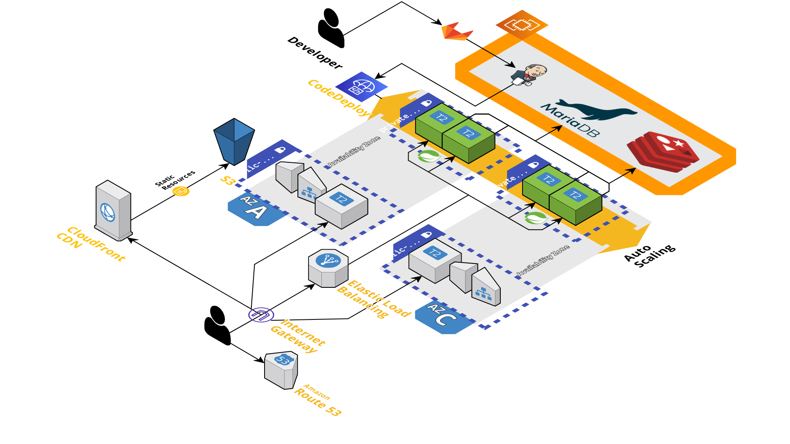
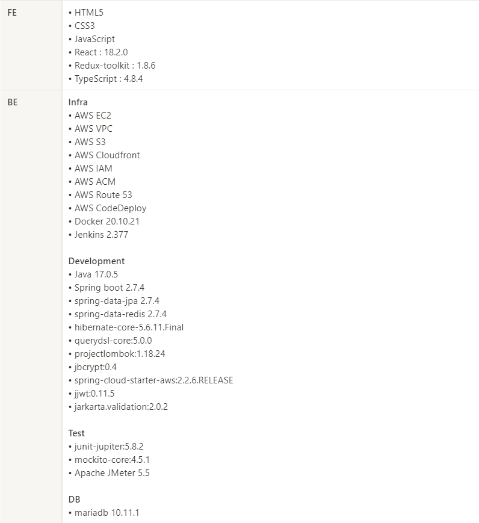

# 💟 우리 그때 만날까?

소중한 추억과 행복했던 순간들을 기록하고, 정해둔 시간이 지나면 사용자가 과거에 작성한 글을 읽을 수 있는 타임 캡슐 서비스입니다.

 

## ✨ 기획 배경

프로젝트의 주제는 특별한 관계를 맺고 있는 사람들이 문자,음성,비디오로 추억을 타임 캡슐에 저장하고,  원하는 날짜에 열어 볼 수 있도록 하는 서비스입니다.

작년, MBC TV 프로그램 “나 혼자 산다” 에서 “행복 저금통” 이라는 주제가 방영된 적이 있었습니다. “행복 저금통” 이란 행복한 일들을 저금통에 저장해 놓고 특별한 날에 저금통을 열어 확인할 수 있는 따뜻한 즐거움입니다. 해당 방영분은 시청자들에게 호평을 받았으며 실제로 “행복 저금통”을 따라하는 누리꾼들도 많았습니다. 저희는 온라인으로 메시지를 저장해 놓고, 특별한 사람들끼리 확인해 볼 수 있는 서비스를 기획했습니다. 온라인으로 간편하게 접속할 수 있는 만큼 많은 사용자들이 저희 서비스를 이용할 것이라 생각됩니다.

 

## 🖥️ 서버 아키텍처

저희 서비스의 아키텍처 구성도입니다.

- 오토스케일링
    - 저희는 크리스마스나 새해 등 특정 시기에 서버에 트래픽이 많이 몰릴 것으로 예상하여 AWS EC2 인스턴스에 오토 스케일링을 적용하여 자동으로 스케일 아웃, 스케일 인이 되도록 구성하였습니다.
- 로드밸런싱
    - AWS VPC를 이용하여 API 서버 인스턴스에 직접 접근하지 못하도록 구성하고, 로드밸런서에 의해서만 접근 가능하도록 했습니다.
- CDN
    - 프론트엔드는 S3와 CloudFront라는 CDN 서비스를 활용하여 HTML 문서와 이미지, 영상과 같은 정적 리소스를 더 빠르고 효율적으로 제공합니다.
- CI/CD, 무중단 배포
    - 백엔드, 프론트엔드 서버 모두 Gitlab, Jenkins, AWS CodeDeploy를 활용하여 CI/CD 환경을 구축하였습니다.

 

## 📚 기술 스택

저희 서비스는 정말 다양한 기술 스택들을 사용했습니다!

 

## 🗒️ 서비스 기능

- [게시글 작성](./assets/docs/%EA%B2%8C%EC%8B%9C%EA%B8%80%20%EC%9E%91%EC%84%B1.md)

- [그룹 생성](./assets/docs/%EA%B7%B8%EB%A3%B9%20%EC%83%9D%EC%84%B1.md)

- [그룹 조회](./assets/docs/%EA%B7%B8%EB%A3%B9%20%EC%A1%B0%ED%9A%8C.md)

- [그룹 참여](./assets/docs/%EA%B7%B8%EB%A3%B9%20%EC%B0%B8%EC%97%AC.md)

- [로그인](./assets/docs/%EB%A1%9C%EA%B7%B8%EC%9D%B8.md)

- [사진 조회](./assets/docs/%EC%82%AC%EC%A7%84%20%EC%A1%B0%ED%9A%8C.md)

- [퀴즈](./assets/docs/%ED%80%B4%EC%A6%88.md)

- [통계](./assets/docs/%ED%86%B5%EA%B3%84.md)

 

## 🔖 프로젝트 빌드 방법

    

 

## 📝 노션 페이지

저희 프로젝트의 문서와 저희 팀원들이 어떤 방법론에 맞춰 작업했는지 알고 싶으시다면 저희 프로젝트 노션 페이지를 방문해주세요!

    

